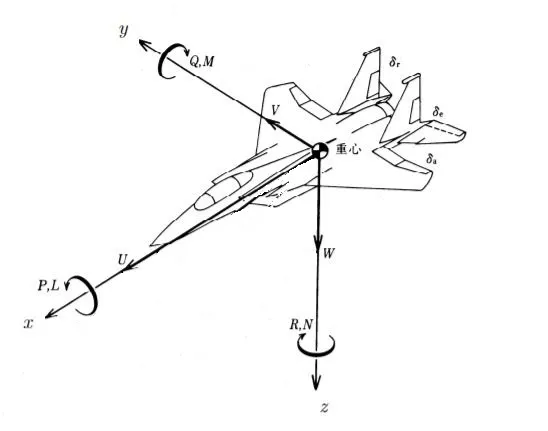

# reset
Bを押しながら挿すとリセット

# UDP
src以下にpasswd.hを追加し、下記の要領で設定
マイコンと同一ネットワークに居るホストPCを用意
HOSTはホストPCのIPとポート

```passwd.h
#define SSID "hugahuga"
#define PASSWD "hogehogehoge"
#define HOST_IP 192,168,10,16//環境に合わせる
#define HOST_PORT 5000
#define LOCAL_IP 192,168,10,15
#define LOCAL_PORT 1234
#define SUBNET_MASK 255,255,255,0
#define GATEWAY_IP 192,168,10,1
#define DNS_IP 192,168,10,1
```

# 状態遷移
| 状態 | LED | 説明 |
| --- | --- | --- |
| STATE_INIT | 500 ms毎の点滅 | 起動初期状態 ESC初期化入力|
| STATE_ERROR | 100 ms毎の点滅 |  |
| STATE_AUTO | 点灯 |  |
| STATE_SEMIAUTO | 800 ms点灯 100 ms消灯の繰り返し |  |
| STATE_MANUAL | 消灯 | 初期状態からプロポ信号取得で遷移 |
| STATE_SBUS_LOST | 素早い2回点滅 | プロポ信号ロストで遷移（復帰あり） |

# プロポ設定
CH8をSEに設定します

// id1 D0  エルロン
// id2 D1  エレベーター
// id3 D2  スロットル
// id4 D3  ラダー
// id5 D6  ギヤ
// id6 D8  エルロン２
// id7 D9  ピッチ
// id8 D10  AUX5

# 座標系
BNOの座標変換は不安定になったので、rpyだけ変換している

https://airmanship.jp/airplane_axis.html